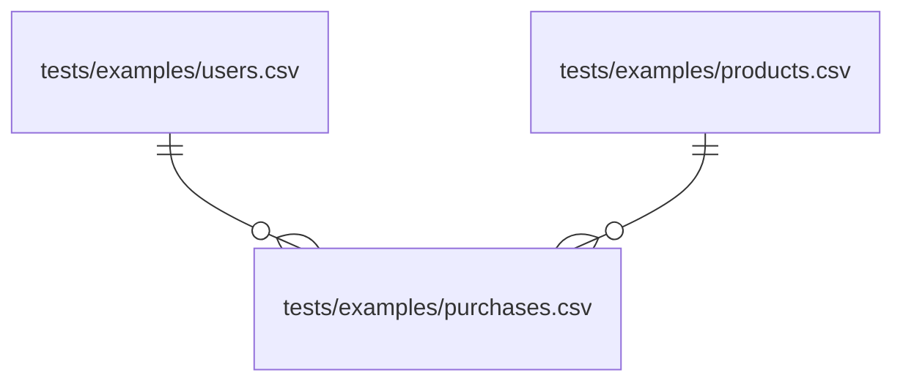

<h1>𝕭𝖑𝖔𝖔𝖉𝖑𝖎𝖓𝖊</h1>

[](https://pypi.org/project/bloodline/)
[](https://github.com/carbonfact/bloodline/actions/workflows/test.yml)

Bloodline is a small library to track *row-level* provenance of data. It is not invasive and does not require modifying your code. Bloodline supports [pandas](https://pandas.pydata.org/), but could to be extended to other dataframe libraries.

We use this at Carbonfact to track data lineage across all the ETL pipelines we use to ingest our customers' data. This allows us to tell them where each data point they see comes from, and to keep track of data quality issues back to their source.

- [Installation](#installation)
- [Getting started](#getting-started)
- [How it works](#how-it-works)
- [User guide](#user-guide)
  - [n-ary return outputs](#n-ary-return-outputs)
  - [Using custom sources](#using-custom-sources)
  - [Inheriting lineage for derived columns](#inheriting-lineage-for-derived-columns)
  - [Manually updating lineage](#manually-updating-lineage)
  - [Generate entity relationship diagrams](#generate-entity-relationship-diagrams)
  - [Toggling tracking on/off](#toggling-tracking-onoff)
- [Roadmap](#roadmap)
- [Contributing](#contributing)
- [License](#license)

## Installation

```sh
pip install bloodline
```

For local development:

```sh
git clone https://github.com/carbonfact/bloodline
cd bloodline && uv sync
uv run pytest
```

## Getting started

Bloodline provides a `Lineage` object, which you use as a decorator. Here’s a minimal example:

```py
>>> import bloodline as bl
>>> import pandas as pd

>>> lineage = bl.Lineage()

>>> @lineage
... def read_products():
...     return pd.read_csv('tests/examples/products.csv')

>>> products = read_products()

```

The dataframe `products` now has a `data_lineage` column, which records the source of each column’s values:

```py
>>> from pprint import pprint
>>> pprint(products["data_lineage"].iloc[0])
{'mass': {'source_metadata': {'file_path': 'tests/examples/products.csv'},
          'source_type': 'DATA_SOURCE'},
 'price': {'source_metadata': {'file_path': 'tests/examples/products.csv'},
           'source_type': 'DATA_SOURCE'},
 'sku': {'source_metadata': {'file_path': 'tests/examples/products.csv'},
         'source_type': 'DATA_SOURCE'}}

```

What's nice is that you don't have to change anything about how you use pandas. You just need to decorate your data-processing functions with `@lineage`. Bloodline takes care of the rest.

Bloodline's default behavior is to impute a default source for new columns:

```py
>>> @lineage
... def calculate_mass_in_kg(products):
...     products["mass_kg"] = products["mass"] / 1000
...     return products

>>> products = calculate_mass_in_kg(products)
>>> pprint(products['data_lineage'].iloc[0])
{'mass': {'source_metadata': {'file_path': 'tests/examples/products.csv'},
          'source_type': 'DATA_SOURCE'},
 'mass_kg': {'source_metadata': {}, 'source_type': 'UNKNOWN'},
 'price': {'source_metadata': {'file_path': 'tests/examples/products.csv'},
           'source_type': 'DATA_SOURCE'},
 'sku': {'source_metadata': {'file_path': 'tests/examples/products.csv'},
         'source_type': 'DATA_SOURCE'}}

```

Bloodline automatically merges `data_lineage` columns when you merge dataframes.

```py
>>> @lineage
... def read_purchases():
...     purchases = pd.read_csv("tests/examples/purchases.csv")
...     purchases = pd.merge(purchases, products, on="sku", how="left")
...     users = pd.read_csv("tests/examples/users.csv")
...     purchases = pd.merge(purchases, users, left_on="user_id", right_on="id", how="left")
...     return purchases

>>> purchases = read_purchases()
>>> for col in purchases.columns.difference(['data_lineage']):
...     print(f"{col}: {purchases['data_lineage'].iloc[0][col]}")
date: {'source_type': 'DATA_SOURCE', 'source_metadata': {'file_path': 'tests/examples/purchases.csv'}}
id: {'source_type': 'DATA_SOURCE', 'source_metadata': {'file_path': 'tests/examples/users.csv'}}
mass: {'source_type': 'DATA_SOURCE', 'source_metadata': {'file_path': 'tests/examples/products.csv'}}
mass_kg: {'source_type': 'UNKNOWN', 'source_metadata': {}}
price: {'source_type': 'DATA_SOURCE', 'source_metadata': {'file_path': 'tests/examples/products.csv'}}
sku: {'source_type': 'DATA_SOURCE', 'source_metadata': {'file_path': 'tests/examples/products.csv'}}
user_id: {'source_type': 'DATA_SOURCE', 'source_metadata': {'file_path': 'tests/examples/purchases.csv'}}

```

## How it works

Here's what happens under the hood at a high level:

1. The `@lineage` decorator enters a context manager, which temporarily installs lineage-aware pandas hooks.
2. Reader functions like `pd.read_csv` populate the dataframe with a `data_lineage` column, tagging each column with its source (e.g., file path)
3. Join methods like `pd.merge` and `DataFrame.join` fuse `data_lineage` together, preserving provenance across dataframes.
4. When the function returns, Bloodline's decorator imputes lineage for any new columns using the decorator's default source.

What's crucial is that **data lineage is tracked at a row level**. If you concatenate two dataframes, each row in the resulting dataframe retains its own provenance. This differs from column-level lineage tracking, which can lose granularity when rows originate from different sources.

The advantages of Bloodline's design are:

- Users write normal pandas code. They don't have to swap `pd.merge` for a custom accessor.
- The `@lineage` decorator overrides pandas' methods temporarily, which avoids global side effects.
- Returning from the decorator triggers a final `apply_data_lineage` pass, ensuring each data point has lineage.

Here are the caveats:

- Not all pandas operations are necessarily covered, which can lead to missed lineage.
- Performance overhead can be significant for large dataframes due to the need to inspect data at a row level.

## User guide

### n-ary return outputs

The `@lineage` decorator assumes by default that the decorated function returns a single dataframe. This can be customized with the `return_arg` parameter:

```python
>>> @lineage(return_arg=0)
... def read_data():
...     return pd.DataFrame({'foo': [1, 2]}), 'bar'

>>> df, label = read_data()
>>> assert 'data_lineage' in df.columns

```

### Using custom sources

The default source can be overriden when instantiating the `Lineage` object:

```py
>>> lineage = bl.Lineage(
...     default_source=bl.Source(
...         source_type="CUSTOM_DEFAULT",
...         source_metadata={"reason": "default for new columns"}
...     )
... )

```

You can also specify custom sources when using the decorator:

```py
>>> @lineage.with_source(
...     source=bl.Source(
...         source_type="SNOWFLAKE"
...     )
... )
... def read_data_from_db():
...     df = pd.DataFrame({'price': [10, 15]})  # simulate reading from a database
...     return df

>>> df = read_data_from_db()
>>> pprint(df['data_lineage'].iloc[0])
{'price': {'source_metadata': {}, 'source_type': 'SNOWFLAKE'}}

```

### Inheriting lineage for derived columns

When creating new columns derived from existing ones, you can instruct Bloodline to inherit lineage from parent columns:

```py
>>> @lineage(
...    inheritance={"discounted_price": "price"}
... )
... def add_discounted_price(df: pd.DataFrame) -> pd.DataFrame:
...     df["discounted_price"] = df["price"] * 0.9
...     df["foo"] = 42  # this column won't inherit lineage
...     return df

>>> products = add_discounted_price(df)
>>> pprint(df['data_lineage'].iloc[0])
{'discounted_price': {'source_metadata': {}, 'source_type': 'SNOWFLAKE'},
 'foo': {'source_metadata': {'reason': 'default for new columns'},
         'source_type': 'CUSTOM_DEFAULT'},
 'price': {'source_metadata': {}, 'source_type': 'SNOWFLAKE'}}

```

### Manually updating lineage

The `@lineage` decorator should cover most use cases, but sometimes you may need to manually adjust lineage information. This is where `bl.apply_data_lineage()` comes in handy. For example, you maybe want to update the lineage for a specific table subset after a bulk operation:

```py
>>> def clip_price(df: pd.DataFrame) -> pd.DataFrame:
...     threshold = 10
...     row_mask = df["price"] > threshold
...     df.loc[row_mask, "price"] = threshold
...     return bl.apply_data_lineage(
...         table=df,
...         default_source=bl.Source(source_type="HEURISTIC", source_metadata={"heuristic_name": "mass_filler"}),
...         row_mask=row_mask,
...         column_names=["price"],
...         override=True,
...     )

>>> df = clip_price(df)
>>> pprint(df['data_lineage'].iloc[1])
{'discounted_price': {'source_metadata': {}, 'source_type': 'SNOWFLAKE'},
 'foo': {'source_metadata': {'reason': 'default for new columns'},
         'source_type': 'CUSTOM_DEFAULT'},
 'price': {'source_metadata': {'heuristic_name': 'mass_filler'},
           'source_type': 'HEURISTIC'}}

```

### Generate entity relationship diagrams

Bloodline keeps track of each join between tables. You can generate E/R diagrams from the detected relationships. The relationship type is inferred from the unicity of the join keys.

```py
>>> import pandas as pd
>>> import bloodline as bl

>>> lineage = bl.Lineage()

>>> @lineage
... def load_products():
...     return pd.read_csv("tests/examples/products.csv")

>>> @lineage
... def load_users():
...     return pd.read_csv("tests/examples/users.csv")

>>> @lineage
... def load_purchases():
...     purchases = pd.read_csv("tests/examples/purchases.csv")
...     users = load_users()
...     merged = pd.merge(left=purchases, right=users, left_on="user_id", right_on="id")
...     products = load_products()
...     merged = pd.merge(left=merged, right=products, on="sku")
...     return merged

>>> purchases = load_purchases()

>>> with open("tests/examples/erd.mmd", "w") as f:
...     f.write(lineage.erd.to_mermaid())

```



### Toggling tracking on/off

Bloodline exposes methods to control tracking at runtime:

- `bl.disable_data_lineage_tracking()` ~ disable tracking globally.
- `bl.enable_data_lineage_tracking()` ~ enable tracking globally.
- `bl.is_data_lineage_tracked()` ~ check if tracking is enabled.
- `bl.temporarily_disable_tracking()` ~ context manager to disable tracking temporarily.

## Roadmap

- Bring more pandas operations under the hook manager (e.g., `DataFrame.fillna`, `DataFrame.where`, `DataFrame.assign`, `pd.melt`).
- Flesh out the developer guide with real-world recipes as new hooks land.
- Experiment with lightweight lineage visualizations once the API surface settles.

## Contributing

Feel free to reach out to [alexis@carbonfact.com](mailto:alexis@carbonfact.com) and [max@carbonfact.com](mailto:max@carbonfact.com) if you want to know more and/or contribute 😊

## License

Bloodline is free and open-source software licensed under the Apache License, Version 2.0.
